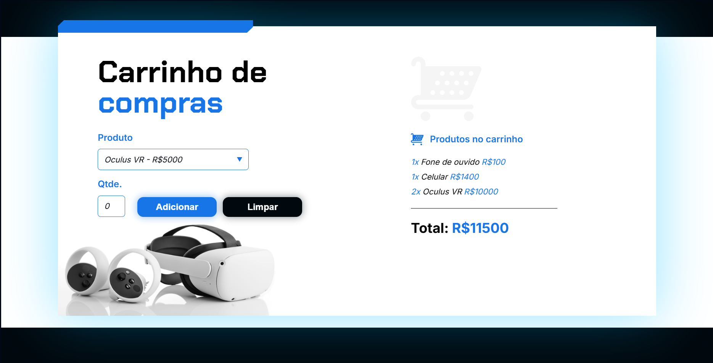

# 🛒 Carrinho de Compras

Bem-vindo ao **Carrinho de Compras**, uma aplicação web simples, interativa e responsiva para simular a experiência de compras online, desenvolvida com **HTML5**, **CSS3** e **JavaScript puro** (*Vanilla JS*).
Com esta solução, você pode adicionar produtos ao carrinho, ajustar quantidades e visualizar o total da sua compra de forma dinâmica e sem recarregar a página.

---

## 🚀 Funcionalidades

✔️ Lista de produtos disponíveis com imagens e preços.
✔️ Adição de produtos ao carrinho com apenas um clique.
✔️ Atualização dinâmica das quantidades diretamente no carrinho.
✔️ Remoção de itens com atualização automática do total.
✔️ Cálculo em tempo real do valor total da compra.
✔️ Navegação e interatividade sem necessidade de recarregar a página.

---

## 🛠️ Tecnologias Utilizadas

* **HTML5** — Estruturação semântica do conteúdo.
* **CSS3** — Estilização moderna, com layout responsivo e efeitos visuais.
* **JavaScript (Vanilla)** — Manipulação do DOM e lógica completa do carrinho.

---

## 🎮 Como Usar

1. Clone este repositório ou faça o download dos arquivos:

   ```bash
   git clone https://github.com/GustavoMarques22/CarrinhoDeCompras.git
   ```
2. Abra o arquivo `index.html` diretamente no seu navegador.
3. Navegue pelos produtos e clique em **Adicionar ao Carrinho** para começar sua simulação de compra.
4. No carrinho, ajuste as quantidades ou remova produtos conforme desejar.
5. Acompanhe o total da sua compra sendo atualizado automaticamente!

---

## 📁 Estrutura do Projeto

```
CarrinhoDeCompras/
│
├── index.html         # Estrutura da página principal
├── css/
│   ├── style.css      # Estilos e layout responsivo
│   └── reset.css      # Reset básico de estilos
├── js/
│   └── cart.js        # Lógica do carrinho e manipulação do DOM
└── img/               # Imagens dos produtos e elementos visuais
```

---

## 🧠 Aprendizados Envolvidos

Este projeto foi desenvolvido com o objetivo de praticar e fortalecer conhecimentos em:

* Manipulação avançada do **DOM** com JavaScript.
* Lógica para atualização dinâmica de valores e quantidades.
* Uso eficiente de **eventos** para interatividade com o usuário.
* Estruturação semântica e acessível com **HTML5**.
* Design **responsivo** e adaptável com CSS moderno.

---

## ✨ Demonstração



---

## 📢 Contribua!

Contribuições são muito bem-vindas!
Se você tiver sugestões, melhorias ou quiser adicionar novas funcionalidades, sinta-se à vontade para abrir uma **issue** ou enviar um **pull request**. 🙌

---

## 💙 Autor

Desenvolvido com dedicação por [**Gustavo Marques**](https://github.com/GustavoMarques22)
Siga-me no GitHub para mais projetos incríveis!

---
